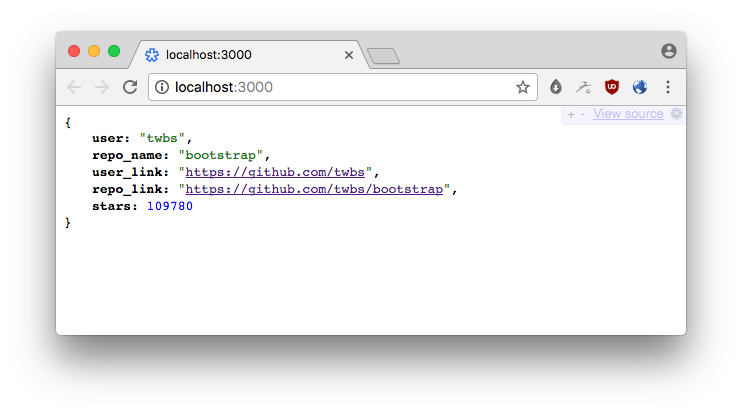

# A Github Star's Microservice API



Built using [micro](https://github.com/zeit/micro).

Clone it and run `npm start`.

Afer changing rep URL in `request` run `now` to publish via [Ziet](https://zeit.co/docs/examples/json-api). 

### Response: 

```json
{
    "user": "twbs",
    "repo_name": "bootstrap",
    "user_link": "https://github.com/twbs",
    "repo_link": "https://github.com/twbs/bootstrap",
    "stars": 109780
}
```